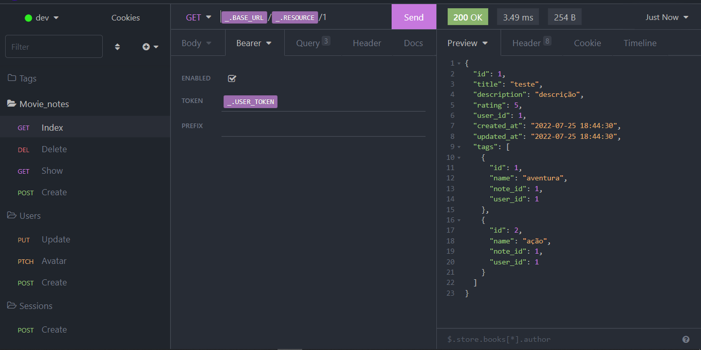

# Rocket Movies API

<h1 align="center">
    
</h1>

<br>

### 💻 Rocket Movies API

Building a Rocket Movies API to consume API REST with NodeJS and Express to the 
Rocket Movies Front end.
Use Insomnia to register routes and check status codes. created the database used 
SQlite, manipulate the database using the tool Beekeper Studio together with Query 
Builder Knex.js.

Watch it in action Deploy: [Click Here](http://rocket-movies-front-end.vercel.app/)

Login User: felipe@mail.com
Password: 123

What was developed:

- Logic and Algorithms with Javascript;
- API REST built in NodeJS e ExpressJS;
- SQLite database to save the data;
- Tool Beekeper Studio;
- Query Builder with tool Knex.js;
- PM2 Advanced process manager for production Node.js applications;
- Multer is a node.js middleware for handling multipart/form-data, which is primarily used for uploading files;
- JWT with jsonwebtoken;
- Data immutability;
- Promises with Async Await;
- Classes and events;
- Inheritance and Polymorphism;
- Route mapping;
- Insomnia to register routes and check status codes;
- Asynchronous and promises;
- Object orientation;
- Data types in javascipt;
- Functions Callbacks;
- ES6 Modules;
- Project file system structure separated by folder;
 
<br />

 <p>Insomnia routes</p>


<br />
## 🧪 Tools

Application developed using the following tools:

- [NodeJS](https://nodejs.org/en/)
- [Express](https://expressjs.com/pt-br/)
- [Insomnia](https://insomnia.rest/download)
- [KnexJS](http://knexjs.org/)
- [Beekeeper Studio](https://www.beekeeperstudio.io/)

## 🚀 Getting started

Clone Project and access folder and start the server it is necessary to have NodeJs
installed and Visual Studio Code.

### Programs needed to Getting started

- [NodeJS](https://nodejs.org/en/)
- [Visual Studio Code - Vscode](https://code.visualstudio.com/)
- [Insomnia](https://insomnia.rest/download)
- [Beekeeper Studio](https://www.beekeeperstudio.io/)
  
Clone the project and access the folder

```bash
$ git clone https://github.com/felipe-gomes-vicente/rocket-movies-api.git
$ cd rocket-movies-api
```

### Install server and start up

```bash
$ cd rocket-movies-api
$ npm install
$ npm run dev
```
PORT Server localhost:3333

<br />

Clone the project and access the folder

```bash
$ git clone https://github.com/felipe-gomes-vicente/rocket-movies-front-end.git
$ cd rocket-movies-front-end
```

<br />

## 📝 License

This project is under the MIT license. See the file [LICENSE](LICENSE) for more details.

---

&nbsp;

<p align="center">Done with 💜 by Felipe Vicente👋</p>

- ## My LinkedIn - [](https://www.linkedin.com/in/felipe-gomes-vicente/)
